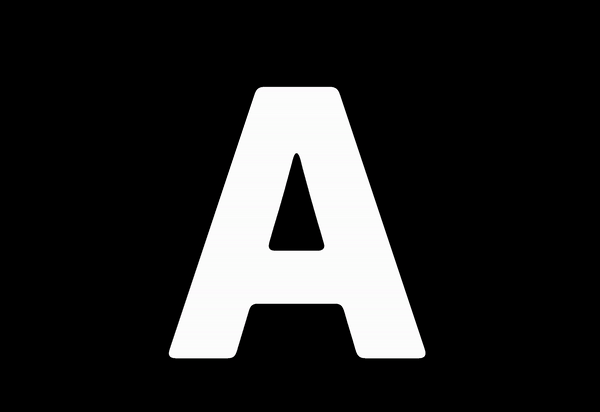

# Kinetic Typography - ink smear
잉크가 번지는 효과와 함께 글씨가 변하도록 구현해본 프로젝트 입니다.

[페이지 바로가기](https://mooyeon-choi.github.io/ink-smear/)

## About The Project

* 일정 시간이 지나면 잉크가 번지는 효과와 함께 글씨가 바뀝니다.
* 마우스로 글자를 흐트러뜨릴 수 있습니다.
* 흐트러진 글자는 일정시간이 지나면 원래 모양으로 돌아옵니다.

#### 2022.06.13 수정

* Fisher-Yates Shuffle 알고리즘 적용
* 글자가 바뀌면서 Particles의 갯수가 달라질 때 균일한 간격으로 particle을 지우거나 추가하도록 변경

## Built With

* JavaScript Canvas
* PIXI

## Getting Started

* `index.html` 파일을 실행하여 로컬환경에서 동작 시킬 수 있습니다.